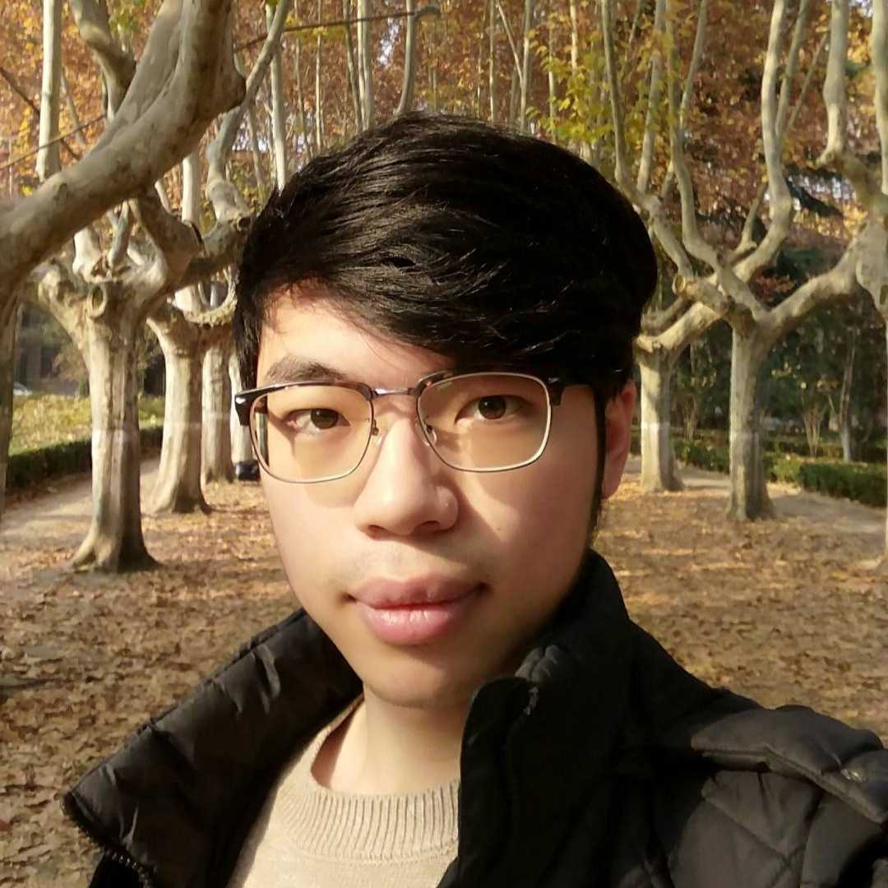

### **Sun Guangda 孙广大**

* Email: sung@comp.nus.edu.sg
* GitHub: [sgdxbc](https://github.com/sgdxbc) (research) / [whoiscc](https://github.com/whoiscc) (personal)

# Education

* Bachelor's degree from Xian JiaoTong University (2020)
* Ph.D student at National University of Singapore (2020-)

# Interests

* **Research:** Network system
    * Distributed protocols
    * Software defined network
    * Network function virtualization
    * Programmable switch
* Programming language
    * Front-end design
    * Garbage collector
    * Interpreter implementation
* Graphic
* Web/desktop applications
* Software verification
* Music
    * Piano
    * Electronic

# Works

## CODER

To configure devices in a software defined network (SDN), e.g., packets routes, network functions location and resource allocation, serveral high-level abstractions and languages, like Merlin and SNAP, are developed. CODER provides an common immediate representation for all SDN languages, defines precise semantic of combining SDN programs, and lets SDN programs written in different languages work together. With CODER user has more power on configuring SDN.

### Publication

Hao Li, Peng Zhang, **Guangda Sun**, Chengchen Hu, Danfeng Shan, Tian Pan, Qiang Fu \
*A Modular Compiler for Network Programming Languages* [pdf](https://nskeylab.xjtu.edu.cn/people/pzhang/files/2020/11/conext20.pdf) \
Proceedings of the 16th International Conference on emerging Networking EXperiments and Technologies (CoNEXT '20)

Hao Li, Peng Zhang, **Guangda Sun**, Chengchen Hu, Danfeng Shan, Tian Pan, Qiang Fu \
*An Intermediate Representation for Network Programming Languages* [pdf](https://conferences.sigcomm.org/events/apnet2020/material/apnet20-final4.pdf) \
Proceedings of the 4th Asia-Pacific Workshop on Networking (APNet '20)

### Repository

[ants-xjtu/sidfam-v3](https://github.com/ants-xjtu/sidfam-v3) (contributed 100% by me)

## Rubik

Rubik is a network stack parser generator for network function middleboxes. It provides a programming model for network protocols and protocol stacks with handful abstractions like flow table and reordered buffer. With Rubik, user can write only hundreds of lines of configuration, which will be transformed into tens of thousands of lines of C code. The generated protocol parser is more efficient than any human-writing ones.

### Publication

Hao Li, Changhao Wu, **Guangda Sun**, Peng Zhang, Danfeng Shan, Tian Pan, Chengchen Hu \
*Programming Network Stack for Middleboxes with Rubik* [pdf](https://www.usenix.org/system/files/nsdi21-li.pdf) \
Proceeding of the 18th USENIX Symposium on Networked Systems Design and Implementation (NSDI '21)

### Repository

[ants-xjtu/rubik](https://github.com/ants-xjtu/rubik) (contributed 99% by me)

## [WIP]

* A run-to-complete NFV framework which can provide isolation with PKU, and can run existing NFs with custom dynimical library loader.
* A BFT protocol which eliminate consensus overhead with programmable switch.

# Projects

## Shattuck

A script language inspired by Rust. Shattuck gives user a chance to use perfect Rust without worring about scary lifetime stuff. The prototype is implemented in Python and offical interpreter is implemented in Rust. I wrote [a serise of articles](https://zhuanlan.zhihu.com/p/65376093) for it on Zhihu.

### Repository

[whoiscc/shattuck](https://github.com/whoiscc/shattuck)

## RIoG

The reference implementation of games project aims to provide a general interface for web-based tiny games, with implementation of several popular games.

### Repository

[whoiscc/riog-project](https://github.com/whoiscc/riog-project)

#### Education

I received a Bachelor in Computer Science from Xian Jiaotong University on July, 2020.

#### Publications

* Hao Li, Changhao Wu, **Guangda Sun**, Peng Zhang, Danfeng Shan, Tian Pan, Chengchen Hu \
  *Programming Network Stack for Middleboxes with Rubik* \
  18th USENIX Symposium on Networked Systems Design and Implementation (NSDI '21 Spring)
* Hao Li, Peng Zhang, **Guangda Sun**, Chengchen Hu, Danfeng Shan, Tian Pan, Qiang Fu \
  *A Modular Compiler for Network Programming Languages* \
  16th International Conference on emerging Networking EXperiments and Technologies (CoNEXT '20)
* Hao Li, Peng Zhang, **Guangda Sun**, Chengchen Hu, Danfeng Shan, Tian Pan, Qiang Fu \
  *An Intermediate Representation for Network Programming Languages* \
  4th Asia-Pacific Workshop on Networking (APNet '20)
  
#### Skills & Interests

I implemented the prototype implementations and take part in most of evaluation of the above works. I'm still mantaining the open source project [Rubik](https://github.com/ants-xjtu/rubik) (prototype for NSDI '21 Spring), which is written in thousands of lines of Python, C and Makefile with rich documentation.

I spent a lot of time on learning various programming language (notably Rust, with seris of articles in Chinese like [this one](https://zhuanlan.zhihu.com/p/88478551)) and thinking about how to design a pratical language which is both easy-to-learn and compatible with the complexity of real world problems. I'm working on a language called Shattuck, which is mostly trait-based Python with real parallization and less hashtable used. Hopefully I will finish it in NUS.

I've been involving in researches on networking for years and I've got some experiences on system designing and abstraction. I also have some ideas on serveral kinds of applications and I will release my first homebrew open-sourced project soon.

----

Online version of this cv is on my [GitHub profile](https://github.com/sgdxbc).
